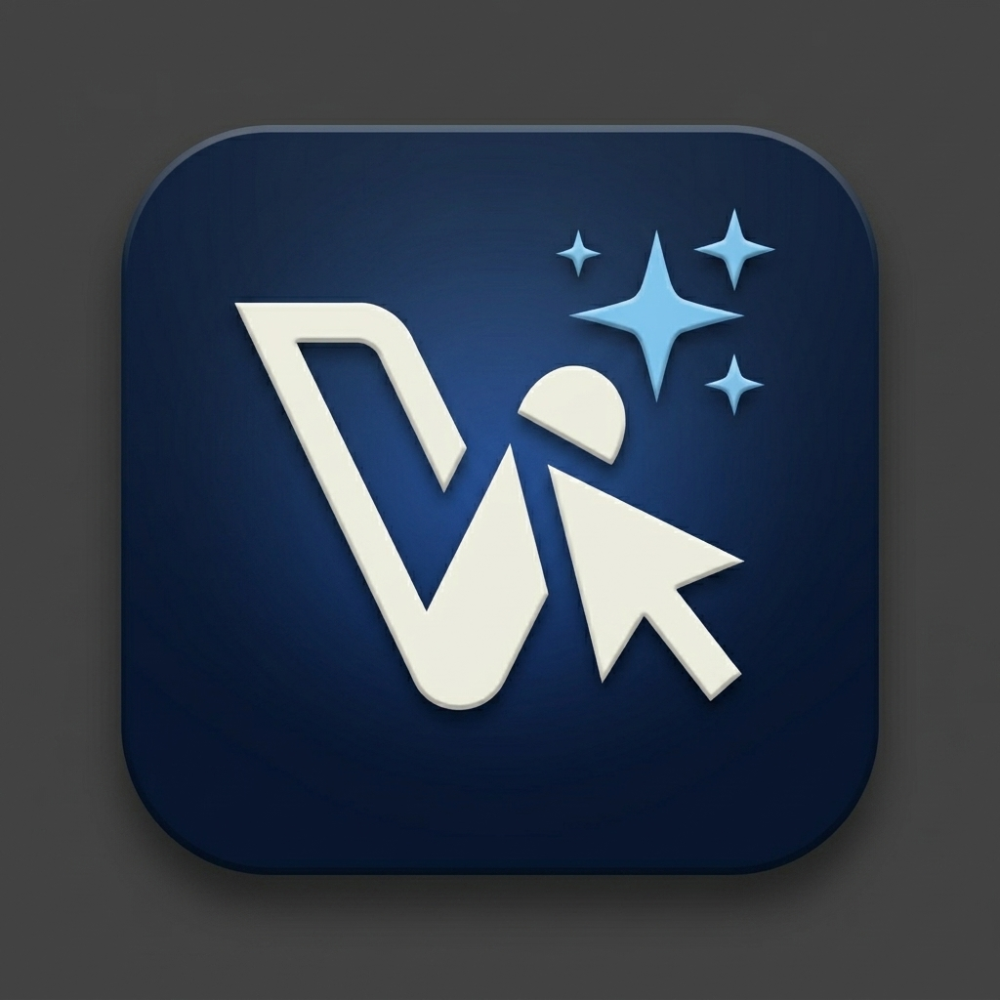

# Branding Guide — VELDRA

## Identity

- **Product name:** VELDRA
- **Display name:** VELDRA
- **Android app label:** VELDRA
- **Android package:** `com.veldra.app`
- **Canonical repository:** `github.com/mertgoevse-wq/VELDRA`
- **Product owner:** Mert Gövse

## Product assets

VELDRA uses original product assets that are separate from upstream branding:

- `public/veldra-logo.svg` — web and documentation wordmark
- `public/veldra-icon.svg` — square app icon source
- `public/veldra-favicon.svg` — browser favicon
- `public/veldra-social-preview.png` — repository/social preview source (raster; see "New brand assets" below)
- `public/assets/brand/` — raw source images the generated web/social assets above were derived from: `veldra-favicon.jpg` (favicon/touch-icon source), `veldra-logo-master.jpg` (master logomark), `veldra-social-preview.jpg` (social card source), `veldra-app-icon.jpg` (app icon mockup reference), `veldra-github-banner.jpg`, `veldra-hero-art.jpg`, `veldra-brand-background.jpg` (pattern texture)

The legacy `public/logo-dark*.png`/`public/logo-light*.png` and `public/bolt-diy-android-*.svg` files were removed (2026-08-10): confirmed via repository-wide search that no code, config, or build script referenced them by name, and they carried old bolt.diy branding.

## New brand assets (2026-08-10)

A refreshed VELDRA mark (a stylized "V" combined with a cursor/click shape and a sparkle, in cream-on-navy) was supplied as raster source images and used to regenerate the web-facing icons: `apple-touch-icon.png`, `favicon-16x16.png`/`favicon-32x32.png`, `veldra-icon-192.png`/`veldra-icon-512.png`, and `veldra-social-preview.png` (all generated from `public/assets/brand/veldra-favicon.jpg` / `veldra-social-preview.jpg` via Pillow). The source images were renamed to their current, more descriptive names on 2026-08-10 after an initial pass used placeholder names (`veldra-logomark-v3.jpg`, `veldra-hero-banner.jpg`); the generated PNGs themselves are unchanged, only the source filenames referenced here were updated.

**Not yet updated to match**: `public/veldra-icon.svg`, `public/veldra-logo.svg`, `public/veldra-favicon.svg`, and the Android adaptive launcher icon (`android/app/src/main/res/drawable/veldra_launcher_foreground.xml`) still use the earlier abstract lightning-bolt vector mark, not the new logomark. Redrawing the new mark as a clean vector (rather than tracing/rasterizing the JPG source, which would be a quality regression for these specific vector-native assets) is a scoped follow-up, not done in this pass.

## Where each of the 7 brand-source images is actually used (2026-08-10, Loop 19)

Existing before this pass — derived PNGs already wired into the app:
- `veldra-favicon.jpg` → `apple-touch-icon.png`, `favicon-16x16.png`/`favicon-32x32.png`, `veldra-icon-192.png`/`veldra-icon-512.png` (linked in `app/root.tsx`)
- `veldra-social-preview.jpg` → `veldra-social-preview.png` (OG/Twitter meta tags in `app/routes/_index.tsx`)

New this pass:
- `veldra-hero-art.jpg` → resized/compressed to `public/veldra-hero-art.webp`+`.jpg` (2.9MB source → ~155KB), shown above the "Where ideas begin" headline in the chat welcome screen (`app/components/chat/BaseChat.tsx`, `#intro` block), desktop only (`lg:` and up) since the illustration's embedded labels aren't legible at mobile widths — lazy-loaded, not rendered on mobile at all.
- `veldra-brand-background.jpg` → resized/compressed to `public/veldra-brand-background.webp` (2.1MB source → ~19KB), used as a faint (8% opacity), masked repeating texture behind the same welcome screen, dark theme + desktop only (the texture's fixed navy background doesn't suit a light theme).
- `veldra-github-banner.jpg` → now the README hero image (`README.md`), referenced directly from `public/assets/brand/` since it's documentation-only and not part of the app bundle.
- `veldra-logo-master.jpg` → no separate integration; it's the same composition as `veldra-favicon.jpg` and serves as the reference master file for the icon set above.
- `veldra-app-icon.jpg` → a rendered app-icon mockup (icon already on a rounded-square backdrop with shadow), not a clean icon source — used here as a visual reference only, not run through the icon generator:

## Visual direction

- Deep indigo surfaces with violet accents
- Clear geometric mark and restrained typography
- Professional developer-tool aesthetic
- No copied upstream wordmarks, logos, or mascots
- Platform assets should be derived from the VELDRA SVG sources where tooling permits

## Upstream attribution and license

VELDRA is derived from the open-source `bolt.diy` project by StackBlitz Labs and contributors. The upstream MIT license, copyright notices, trademarks, and attribution remain in `LICENSE` and `NOTICE.md`. These references describe technical origin and legal attribution; they are not VELDRA product branding.
