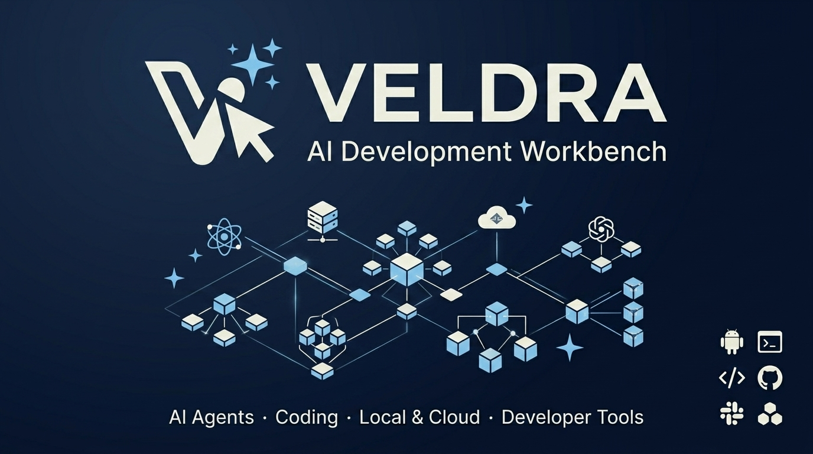

# VELDRA



> **Android port & adaptation © 2026 Mert Gövse.**  
> Based on **bolt.diy** by **StackBlitz Labs** and contributors.  
> Original MIT license and notices are fully retained.

[](./LICENSE)
[](https://github.com/mertgoevse-wq/VELDRA/pulls)

---

## What is VELDRA?

**VELDRA** is a provider-agnostic AI development workbench for web, desktop, Android, and remote runtimes. The Android shell uses [Capacitor](https://capacitorjs.com/) and includes fallback UI panels and adapters for responsive, stable, offline-ready mobile development. VELDRA is derived from the open-source [bolt.diy](https://github.com/stackblitz-labs/bolt.diy) project; the required upstream attribution and MIT license are retained below.

VELDRA lets you chat with LLMs, generate code, browse files, and edit projects on standard mobile devices while preserving a path to desktop and remote execution.

---

## About this Repository

- **Description**: Provider-agnostic AI development workbench with Capacitor, local IndexedDB fallback persistence, and Android WebView support.
- **Topics**: `veldra`, `android`, `capacitor`, `webview`, `ai-development-workbench`, `typescript`, `react`, `vite`, `indexeddb`, `mobile`, `open-source`
- **Social Preview**: [veldra-social-preview.png](./public/veldra-social-preview.png)
- **Brand Assets**: [veldra-icon-192.png](./public/veldra-icon-192.png), [veldra-icon-512.png](./public/veldra-icon-512.png), [veldra-mark-dark.png](./public/veldra-mark-dark.png), [veldra-mark-light.png](./public/veldra-mark-light.png)

---

## Android Status Table

Honest status, not aspirational — a feature is only marked "Complete" once it has been tested for real, not merely compiled. Full detail (including exact verification method) lives in `docs/ai-state/CURRENT_STATE.md` (the actively-maintained living doc; `project/STATUS.md` is an earlier session's historical record, kept for reference but no longer updated).

| Feature | Status | Notes |
|---------|--------|-------|
| **Capacitor WebView Shell** | ⚠️ Partially verified | The web SPA bundle builds and renders correctly (verified via headless-Chromium screenshot against the real production output, 2026-08-16); the *native* Android APK (Capacitor/Gradle) has not been built or run in this development environment — no Android SDK available. See "APK Build Instructions" below for real status |
| **LLM Chat & Prompting** | ✅ Works | Provider-agnostic: OpenAI, Anthropic, Google Gemini, Ollama, OpenRouter, DeepSeek, Mistral, and more |
| **Mobile Provider/Model Selection** | ✅ Works | Native bottom sheets on mobile (search, keyboard-accessible, focus trap, Escape/backdrop close), dropdowns on desktop — same shared provider/model architecture underneath |
| **File Editor (CodeMirror)** | ✅ Works | Touch editor controls, copy/paste, and auto-save |
| **File Persistence** | ✅ IndexedDB | Workspace files and chat history persist locally across app restarts |
| **Touch DnD Backend** | ✅ Complete | Layout drag-and-drop works on touchscreens (React DnD Touch Backend) |
| **Mobile Settings** | ✅ Complete | Compact grouped list navigation (Account / AI Setup / Workspace / …), real `<button>` semantics, `focus-visible`, 44px+ touch targets |
| **Composer** | ✅ Works | Shared, error-isolated upload pipeline for drag-and-drop, paste, and file picker (multi-file); animated skin-aware accent border |
| **Skin System** | ✅ Complete | 11 selectable skins: 9 structurally distinct visual languages (Glass, Liquid Glass, Spatial, Neomorphism, Claymorphism, Skeuomorphism, Minimalism, Maximalism, Brutalism — each changes radius, shadow, blur, border, and motion, not just color), plus the default VELDRA look (no override) and a dark-palette-only "Obsidian" variant |
| **Terminal** | ⚠️ Partial | Real WebSocket-based remote command runner exists (`RemoteCommandPanel`) with connection/status/error states — requires a configured Remote Runtime server; falls back to a clear "not configured" state otherwise, never a fake shell |
| **Preview** | ⚠️ Partial | Local static HTML preview (Blob URL) works offline; Live Server preview requires a WebContainer (desktop browser) or a configured Remote Runtime, with an honest "Live Preview Unavailable" state and remote-preview status card otherwise |
| **WebContainer Interception** | ✅ Safe | Intercepts commands (npm install, shell, start) and fails gracefully with toasts on platforms without WebContainer support |
| **Automated APK Builds** | 📋 Scripted, unverified | `pnpm run android:apk:debug` is wired end-to-end (web build → Capacitor sync → Gradle), but has not actually been run to completion in this development environment (no Android SDK) — the web-build half is verified (see above), the Gradle/native half is not |

---

## Key Features

- 📱 **Mobile-First Design**: Every primary surface (home, composer, Settings, provider/model pickers) is designed and tested first at 360–430px, with desktop as an expanded adaptation — not the other way around.
- 🎨 **11-Skin Design System**: 9 structurally distinct visual languages sharing one token layer (radius, shadow, blur, border, motion) — switching skins changes real controls, not just an accent color — plus the default look and a dark-palette-only variant.
- 💾 **Local File Persistence**: IndexedDB adapter automatically restores your projects and chat history on relaunch.
- ⚡ **Offline-Ready UI Shell**: Runs as a pure Client-Side Rendered (CSR) app — no active Node.js server or Cloudflare environment is required to load the UI.
- 🖼️ **Local Static HTML Preview**: Compile an `index.html` file into a local Blob URL to test layouts offline; Remote Runtime support for a real live preview.
- 🌊 **Ambient Breathing Background**: A slow, GPU-cheap radial-gradient glow behind the homescreen — respects `prefers-reduced-motion`.
- ✨ **Animated Startup Splash**: A brief branded launch screen (mark, wordmark, copyright) timed with the native Android splash, before handing off to the app.

---

## Quick Start & Web Preview

### Prerequisites

1. **Node.js** ≥ 18.18
2. **pnpm** ≥ 9 (this repo pins `pnpm@9.14.4` via the `packageManager` field — `corepack enable` will pick it up automatically)
3. **Android SDK & Studio** (for native builds)

### 1. Setup & Installation

```bash
# Clone the repository
git clone https://github.com/mertgoevse-wq/VELDRA.git
cd VELDRA

# Install dependencies
pnpm install
```

### 2. Run the Local Web Preview

To run the Android WebView shell configuration in your browser (no server dependencies required):

```bash
# Start Vite development server in Android SPA mode
pnpm run android:dev

# Or preview the production SPA bundle locally on localhost
pnpm run android:webbuild
pnpm run android:webpreview
```

### 3. Expose Preview on Wi-Fi (Host 0.0.0.0)

To open the web version on your physical phone (on the same Wi-Fi network):

```bash
# Run dev server exposed to local network
pnpm run android:dev:host

# Run production preview exposed to local network
pnpm run android:webpreview:host
```

---

## APK Build Instructions

To build a native Android package (`.apk`):

```bash
# Compile web assets, sync Capacitor, and generate Debug APK in one step:
pnpm run android:apk:debug
```

Once the process finishes, the compiled artifact is generated at:
`android/app/build/outputs/apk/debug/app-debug.apk`

- **Open in Android Studio**: Run `pnpm run android:open`
- **Deploy to connected USB device**: Run `pnpm run android:run`
- **Release builds**: Running `pnpm run android:apk:release` compiles the release target. Note that signing keys must be configured in `android/app/build.gradle` to produce a signed distributable APK.

---

## Limitations & Fallback UX

Since standard Android WebViews do not support `SharedArrayBuffer` and WebContainers, the following adapters are implemented:
1. **Terminal**: `RemoteCommandPanel` opens a real WebSocket connection to a user-configured Remote Runtime server and shows live connection/output/error state. Without a server configured, it shows a clear "not configured" card with a direct link to Settings — it never simulates a fake shell.
2. **Preview**: If the workspace files contain an `index.html` file, a **"Run Basic Static Preview"** button compiles it into an offline Blob URL inside the frame. An asset warning banner is rendered at the top of the frame. Live Server preview additionally works automatically inside a WebContainer-capable desktop browser, or via a configured Remote Runtime; otherwise an honest "Live Preview Unavailable" state is shown instead of a fake result.
3. **Command Runner**: Any shell/build commands triggered by LLM outputs are captured, flagged as completed/failed, and trigger a brief Toast warning instead of causing UI freezes.

---

## Roadmap

- [x] **Mobile UI Pass**: Restyle chat buttons, dialogs, header, and Settings to prevent overflow and unselectable controls on 360–430px wide devices.
- [x] **Skin System**: 11 selectable skins (9 structurally distinct visual languages, plus the default look and a dark-palette variant) sharing one token layer.
- [x] **Startup Splash**: Animated branded launch screen synced with the native Capacitor splash.
- [ ] **Remote Runtime Server**: Implement a lightweight Node.js/Docker sandbox backend that `RemoteCommandPanel` and the Live Preview status card can connect to, so Terminal and Preview work beyond their current "not configured" fallback states.
- [ ] **Native File Picker**: Hook Capacitor Filesystem API to export/import files into the phone's native storage.
- [ ] **Signed APK Releases**: Add automatic workflow generation for production APK releases.
- [ ] **Native APK Build + Physical Device Testing**: Run the actual Gradle/Capacitor build and validate on a real Android device or emulator — blocked on Android SDK availability in the development environment; the web SPA half is verified (see Android Status Table above), the native packaging half is not.

---

## Licensing & Attribution

VELDRA is an independent product derived from the original open-source project **bolt.diy**.

- **Original Project**: [bolt.diy by StackBlitz Labs](https://github.com/stackblitz-labs/bolt.diy)
- **License**: MIT (Retained in full in [LICENSE](./LICENSE))
- **Trademarks & Copyright**: All original trademarks and logos belong to StackBlitz Labs and contributors. VELDRA uses original product assets (`public/veldra-icon-192.png`, `public/veldra-icon-512.png`, `public/veldra-mark-dark.png`, `public/veldra-mark-light.png`, and `public/veldra-social-preview.png`). The upstream name and attribution below describe the project's technical origin only.
